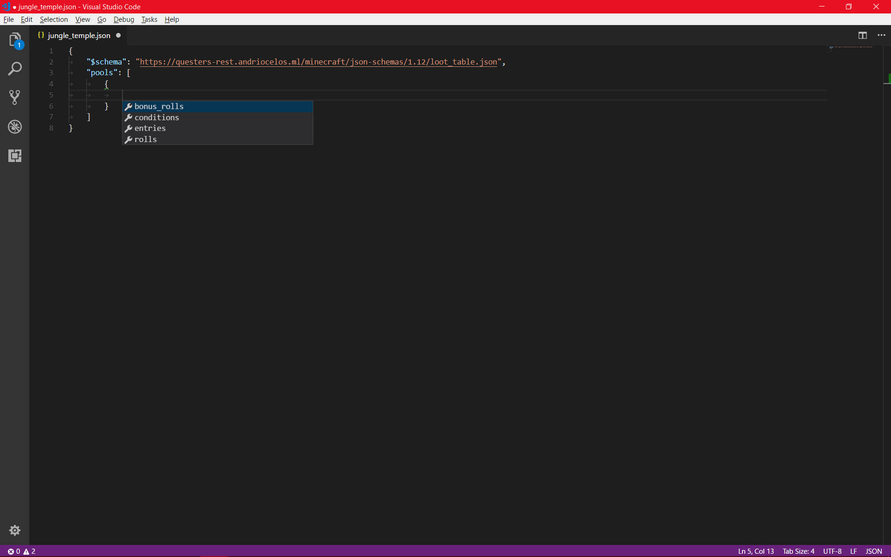
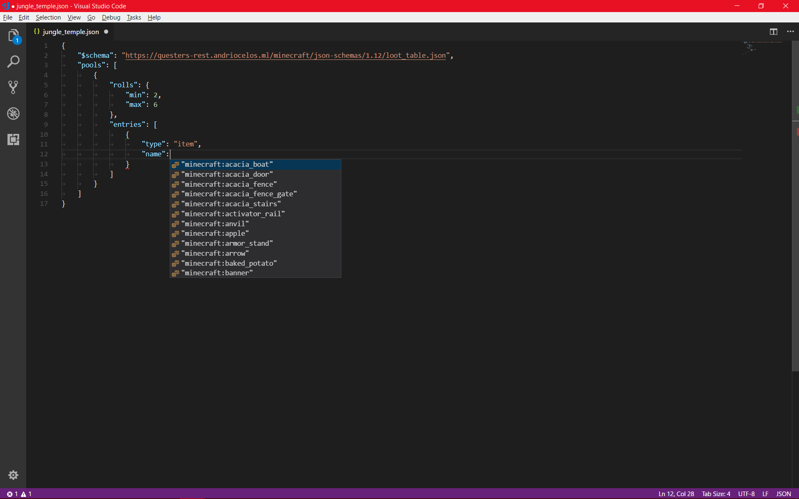
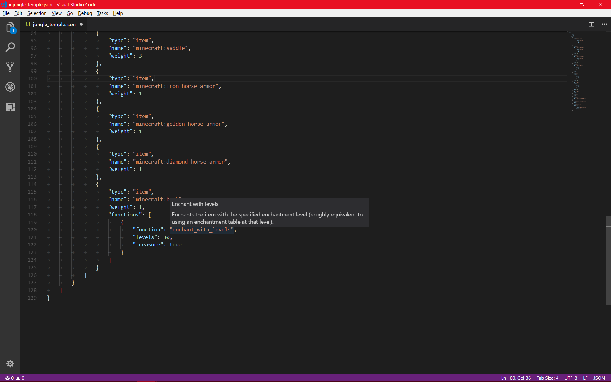
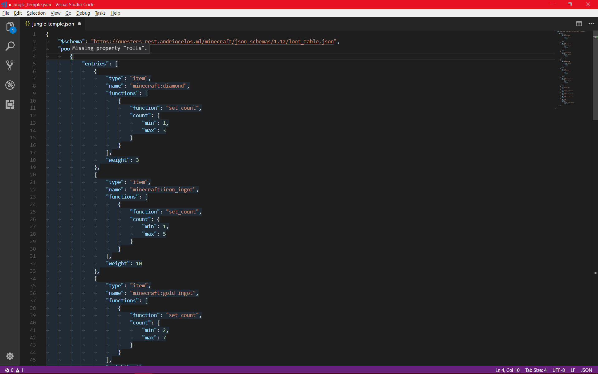

Minecraft JSON Schemas
======================

This is a collection of JSON schemas for Minecraft data objects. They are designed to be used with [Visual Studio Code](https://code.visualstudio.com/) to provide validation and completion suggestions.

The schemas are based on information from [the Minecraft Wiki](https://minecraft.gamepedia.com/).

Usage
-----

To use one of these schemas in Visual Studio Code, simply add the following property to a JSON document:
```JSON
{
	"$schema": "https://questers-rest.andriocelos.ml/minecraft/json-schemas/<Minecraft version>/<schema name>.json"
}
```

Alternatively, you can add the following properties to your [settings](https://code.visualstudio.com/docs/getstarted/settings) file to automatically apply a schema based on the file path:
```JSON
"files.associations": {
	"pack.mcmeta": "json"
},
"json.schemas": [
	{
		"fileMatch": [ "assets/minecraft/advancements/*.json", "data/advancements/*.json" ],
		"url": "https://questers-rest.andriocelos.ml/minecraft/json-schemas/1.12/advancement.json"
	},
	{
		"fileMatch": [ "assets/minecraft/models/block/*.json" ],
		"url": "https://questers-rest.andriocelos.ml/minecraft/json-schemas/1.12/block_model.json"
	},
	{
		"fileMatch": [ "assets/minecraft/blockstates/*.json" ],
		"url": "https://questers-rest.andriocelos.ml/minecraft/json-schemas/1.12/block_states.json"
	},
	{
		"fileMatch": [ "assets/minecraft/models/item/*.json" ],
		"url": "https://questers-rest.andriocelos.ml/minecraft/json-schemas/1.12/item_model.json"
	},
	{
		"fileMatch": [ "assets/minecraft/loot_tables/*.json", "data/loot_tables/*.json" ],
		"url": "https://questers-rest.andriocelos.ml/minecraft/json-schemas/1.12/loot_table.json"
	},
	{
		"fileMatch": [ "pack.mcmeta" ],
		"url": "https://questers-rest.andriocelos.ml/minecraft/json-schemas/1.12/resource_pack.json"
	},
	{
		"fileMatch": [ "assets/minecraft/sounds.json" ],
		"url": "https://questers-rest.andriocelos.ml/minecraft/json-schemas/1.12/sounds.json"
	}
]
````

Screenshots
-----------





